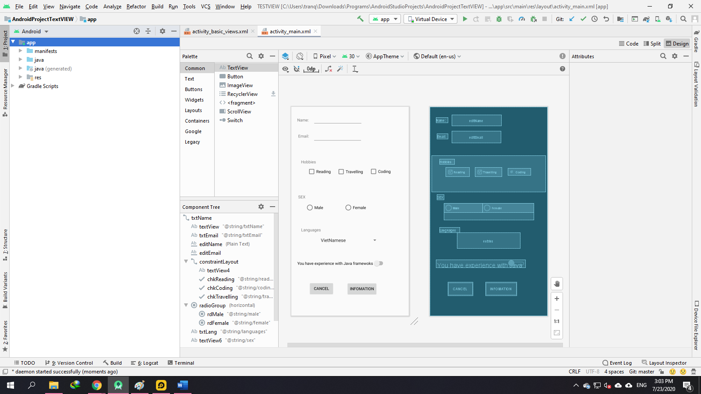

### Các views cơ bản và trong giao diện ứng dụng Android

- <a href= "https://ngocminhtran.com/2018/09/24/cac-views-co-ban-va-trong-giao-dien-ung-dung-android/"> Ứng Dụng Từ Bài</a>

- Trong bài này chúng ta sẽ tìm hiểu các views cơ bản dùng cho việc thiết kế giao diện đồ họa trong Android. Một số views được đề cập trong bài viết:
### Yêu Cầu
A. MÔ TẢ VỀ Android Studio:

- <a href= "https://ngocminhtran.com/2018/09/24/textview/"> TextView </a> 
- <a href= "https://ngocminhtran.com/2018/09/24/textview/"> PlainText </a> 
- <a href= "https://ngocminhtran.com/2018/09/24/textview/"> CheckBox </a> 
- <a href= "https://ngocminhtran.com/2018/09/24/textview/"> RadioButton và RadioGroup </a> 
- <a href= "https://ngocminhtran.com/2018/09/24/textview/"> Switch </a> 
- <a href= "https://ngocminhtran.com/2018/09/24/textview/"> Spinner </a>
- <a href= "https://ngocminhtran.com/2018/09/24/textview/"> ImageView </a>
- <a href= "https://ngocminhtran.com/2018/09/24/textview/"> Button </a>

- Chúng Ta thực hiện như cascc bước trên chúng ta sẽ ra được thành quả như hình:

### Chúc Các Bạn Thành Công !!!

### Bạn Có Thể Xem Bài Tiếp Theo:

- <a href="https://ngocminhtran.com/2018/09/24/thiet-lap-va-nhan-thong-tin-tu-cac-views/">Thiết lập và nhận thông tin từ các Android views!</a>

                                                                         Trần Phú , Ngày 23 tháng 7 Năm 2020
